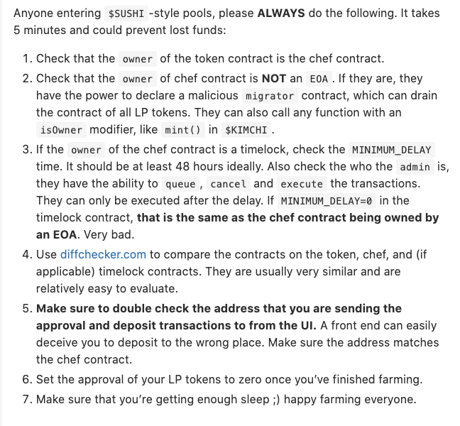

# Yield Farming Forensic Lab

Welcome to yield farming forensic lab. We are located on Planet Earth, Milky Way

This lab is for analysizing crops with the goal of distinguishing [weeds](https://www.youtube.com/watch?v=DDz4ftjllCs) and crops. 

# Native crops

| Name                | Author   | Link                                                                                               |
| ------------------- | -------- | -------------------------------------------------------------------------------------------------- | 
| Timelock contract   | Compound | https://raw.githubusercontent.com/compound-finance/compound-protocol/master/contracts/Timelock.sol |
| MasterChef          | Sushi    | https://etherscan.io/address/0xc2edad668740f1aa35e4d8f227fb8e17dca888cd#code                       |

# Review

- [Sake](Sake.md)
- [Sashimi](Sashimi.md)
- [Pickle](Pickle.md)
- [Arbinyan](nyan.md)

# TBD

- [Swerve](https://swerve.fi/)
- Moon
- Bee

# Farming tools

| Name         | Link                         | 
| ------------ | ---------------------------- | 
| Diff checker | https://www.diffchecker.com/ |

# Methodology

Thanks to [Weebs](https://twitter.com/Weeb_Mcgee/status/1304197352073375746) for sharing trade secret on weed identification

# Disclaimer

This is not a formal security audit